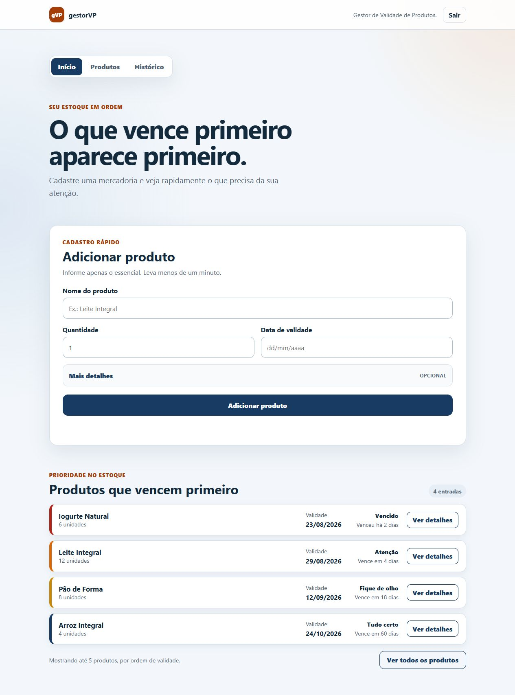
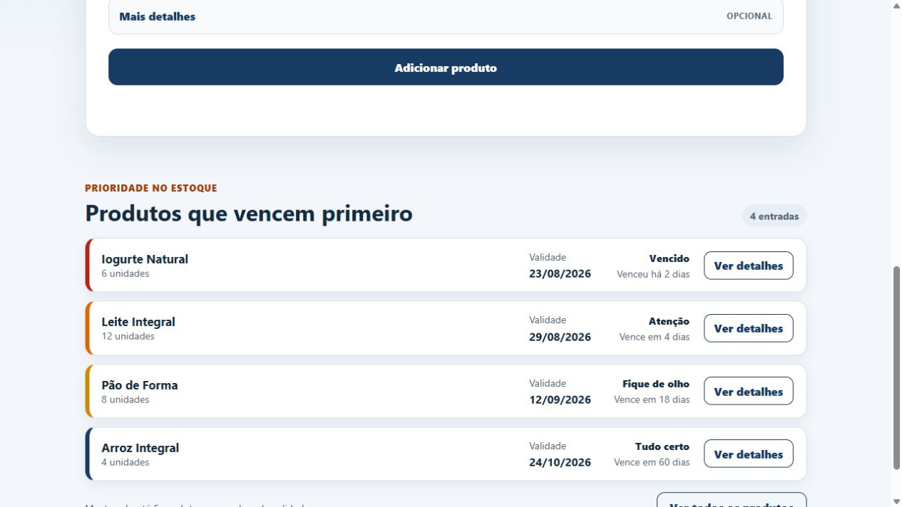
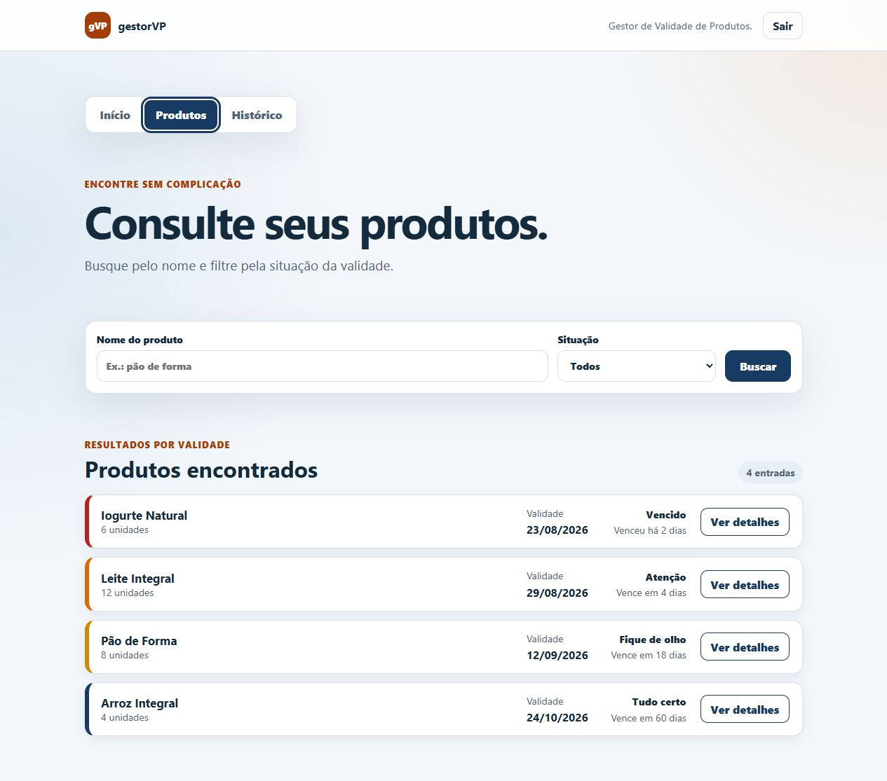
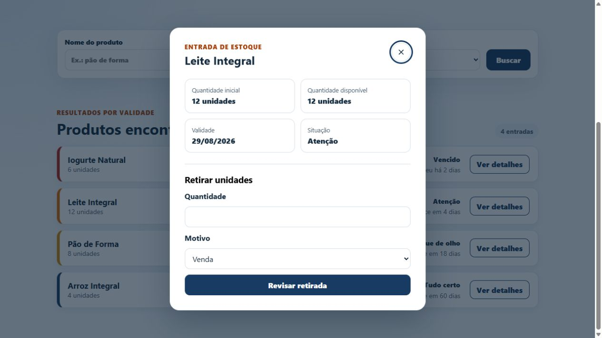
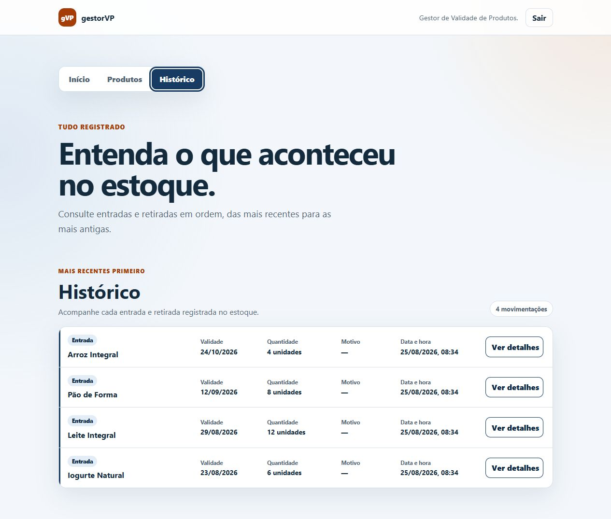
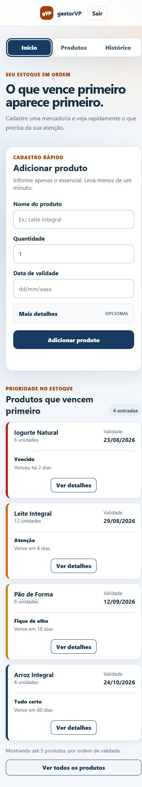

# Demonstração do MVP

O MVP do gestorVP está publicado em
[gestor-vp-production.up.railway.app](https://gestor-vp-production.up.railway.app/).
A página de acesso é pública, mas as credenciais permanecem privadas por
enquanto. O uso autenticado depende de autorização do responsável pelo
projeto.

## O que a demonstração apresenta

- início com até cinco itens que exigem atenção;
- consulta completa por nome e situação;
- cadastro de entradas com detalhes opcionais;
- retirada de unidades com revisão e confirmação;
- histórico de entradas e retiradas;
- experiência responsiva em desktop, tablet e celular.

## Limitações operacionais

- o ambiente usa uma única conta de operador;
- a base contém somente dados sintéticos e descartáveis;
- os dados da demonstração são restaurados após 24 horas;
- o serviço usa o modo Serverless do Railway e pode apresentar cold start;
- em 25/08/2026, o primeiro acesso após uma janela prolongada sem tráfego
  respondeu `200` em 14,88 segundos;
- a demonstração não possui SLA e não deve receber dados reais.

## Capturas de tela

### Início

### Prioridades

### Produtos

### Detalhes

### Histórico

### Celular

As imagens foram produzidas em 25/08/2026 numa composição Docker local e
isolada, com dados sintéticos equivalentes aos da demonstração. Nenhuma
credencial de produção aparece nas capturas.

## Apresentação

A apresentação de oito slides está em
[gestorVP-MVP.pptx](gestorVP-MVP.pptx). Ela resume o problema, a solução, os
fluxos entregues, as evidências de qualidade e as limitações operacionais.
